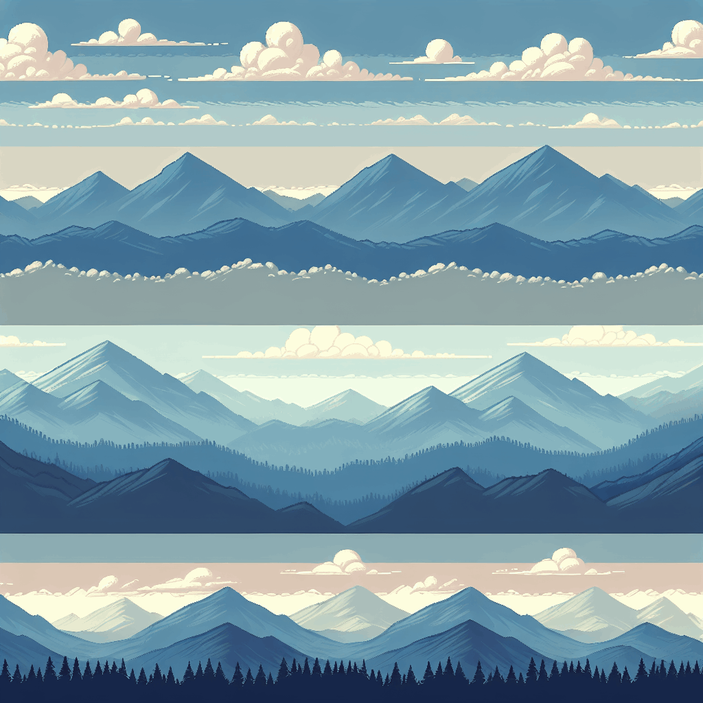

# Parallax Scrolling GIF Generator using OpenAI DALL-E-3

This program generates parallax backgrounds using OpenAI's **DALL-E-3**.
Prompts are crafted by **GPT-4.1 Nano** to create images with 4 distinct layers (256px each).
An algorithm extracts each layer, making the rest transparent.
These layers simulate parallax scrolling, recorded as a GIF.

Prompts, images, layers, and GIFs are stored in their respective directories with timestamped filenames. 
This entire flow is automated via a [GitHub Actions workflow](.github/workflows/gif_publisher.yml) **CRON** that executes daily at 04:00 UTC (06:00 CET).

IMPORTANT: One is completely at the mercy of DALL-E's API, which may not always produce the desired results - and thus may not always render a nice parallax effect or even a valid GIF.

## Today's GIF

## Today's Image

**Prompt:** Four distinct horizontal parallax strips, each 256px tall with seamlessly tiling elements:

**Top Strip (0-256px):**  
- Color tone: Light pastel beige (#FDF5E6)  
- Elements: Small, simple geometric shapes like circles and squares in soft pastel shades (light blue, pink, mint). These shapes are evenly spaced and tile seamlessly horizontally, creating a subtle, airy background suitable for distant scenery. No complex details, just minimalistic repeating patterns.
