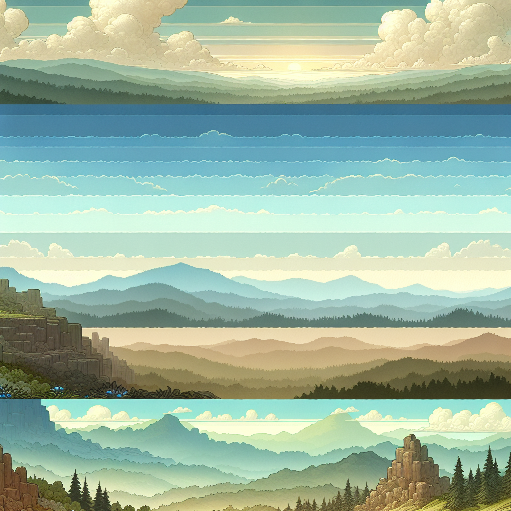

# Void Parallax Generator using OpenAI DALL-E-3

This repository contains a program designed to generate unique parallax backgrounds using OpenAI's **DALL-E-3** model. The input prompt for the model is produced by **GPT-4.1 Nano**, which creates contextual prompts for backgrounds consisting of 4 distinct horizontal layers (256px, 512px, 768px, 1024px). The generated image is processed by an algorithm that isolates each layer, keeping only the relevant 256px segment visible while making the rest transparent. These layers are used in a parallax scrolling simulation, where a camera moves along the x-axis, causing the layers to scroll at different speeds. The parallax movement is recorded as a GIF using a middleware.

Prompts, images, layers, and GIFs are stored in their respective directories with timestamped filenames. This entire flow is automated via a [GitHub Actions workflow](.github/workflows/gif_publisher.yml) **CRON** that executes daily at 04:00 UTC (06:00 CEST).

## Today's GIF

## Today's Image

**Prompt:** A 2025s-style parallax background with limited palette. Layer 1: Distant starry sky with faint nebulae, subtle glow. Layer 2: Distant mountains silhouette, smooth curves, minimal detail. Layer 3: Rolling hills with simple trees, repetitive patterns. Layer 4: Foreground cityscape with blocky buildings, roads, and streetlights.